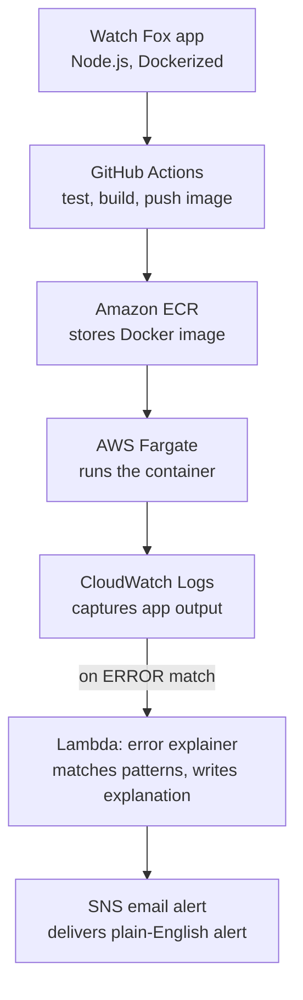

# Watch Fox

A small containerized app deployed on AWS, wired up with a full CI/CD pipeline and
a self-diagnosing error alert system, built as a hands-on portfolio project to
demonstrate my AWS architecture and DevOps skills.

## What it does

1. A simple Node.js/Express app runs in a Docker container.
2. Every push to `main` triggers a GitHub Actions pipeline that tests the code,
   builds a Docker image, and pushes it to Amazon ECR.
3. The container runs on AWS Fargate, no EC2 servers to patch or manage.
4. CloudWatch Logs captures everything the app outputs, including errors.
5. When an error appears in the logs, a subscription filter triggers a Lambda
   function that matches the error against a set of known patterns and writes
   a plain-English explanation of what likely went wrong.
6. That explanation is emailed out via SNS.

## Architecture



## Tech stack

- **App**: Node.js, Express
- **Containerization**: Docker
- **CI/CD**: GitHub Actions
- **Image registry**: Amazon ECR
- **Compute**: AWS Fargate (ECS)
- **Logging**: Amazon CloudWatch Logs
- **Error explanation**: AWS Lambda (Python) with rule-based pattern matching
- **Alerting**: Amazon SNS (email)

## Why rule-based, not an LLM API

The error explainer was originally built to call the Claude API for
explanations. It was switched to a rule-based keyword matcher instead, the
Lambda function checks incoming error text against a set of known patterns
(timeouts, connection refused, out-of-memory, permission denied, DNS
failures, 5xx errors, etc.) and returns a pre-written explanation for
whichever pattern matches.

This was a deliberate trade-off:
- **Zero ongoing cost** - no external API account or credits needed, runs
  entirely within AWS's free tier.
- **Instant response** - no network round-trip to a third-party API.
- **Trade-off**: it only recognizes error types it's been explicitly
  programmed to detect. A genuinely novel error falls back to a generic
  "investigate manually" message rather than a reasoned explanation.

Swapping in an LLM (Claude via direct API or AWS Bedrock) is a straightforward
change, replace the pattern-matching function in `lambda_function.py` with
an API call, and would trade the zero-cost guarantee for a system that can
explain error types it's never seen before.

## Cost

Everything in this project runs within AWS's free tier at low usage:

| Service | Free tier | Notes |
|---|---|---|
| ECR | 500 MB storage | Image is ~75 MB |
| Lambda | 1M requests/month | Rule-based, no external calls |
| CloudWatch Logs | Low-volume free | Negligible at this scale |
| SNS | 1,000 emails/month | Only fires on real/simulated errors |
| **Fargate** | **Not free tier** | ~$0.01–0.015/hour while a task is `RUNNING` |

Fargate is the only billed component. Tasks are run on-demand for
demos/testing and stopped immediately after not left running continuously.
A CloudWatch billing alarm is also configured to email if total AWS charges
exceed $1.

## Local development

```bash
npm install
npm start
```

Visit `http://localhost:8080` and `http://localhost:8080/health`.

### Build and run with Docker

```bash
docker build -t watch-fox .
docker run -p 8080:8080 watch-fox
```

## Testing the alert pipeline

With a Fargate task running, hit:

```
http://<task-public-ip>:8080/simulate-error
```

This logs a simulated database timeout error, which flows through
CloudWatch → Lambda → SNS → email within a few seconds.

## Possible next steps

- Replace the manual run/stop Fargate task with an ECS **service** for
  always-on availability (trades the zero-downtime demo for continuous
  Fargate billing).
- Add a simple status-dashboard UI.
- Swap the rule-based explainer for an LLM-backed one (Claude API or AWS
  Bedrock) for handling novel/unrecognized errors.